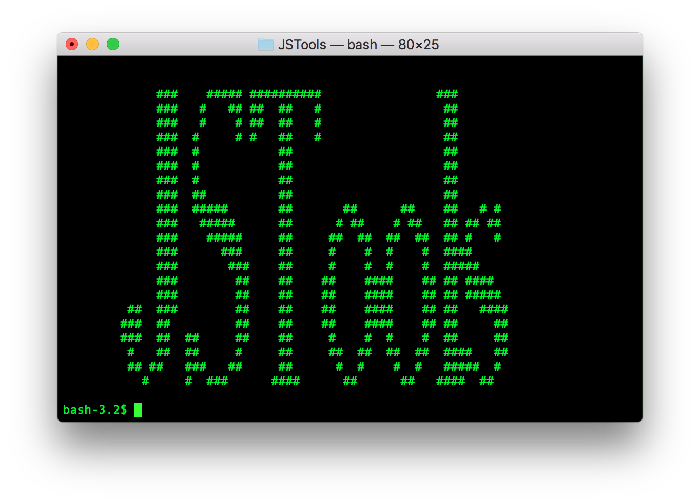

# JSTools: JavaScript for shell scripting

## Introduction
*JSTools* provides command line applications for shell scripting.
* [jsh](#jsh): A shell program based on the JavaScript.
* [jsdecl](＃jsdecl): Type declaration generator. You can generate type declaration define in [JavaScript package](https://github.com/steelwheels/JSTools/blob/master/Document/jspkg.md).
* [jsstorage](#jsstorage): Dump the contents of storage files in [JavaScript package](https://github.com/steelwheels/JSTools/blob/master/Document/jspkg.md) in JavaScrip package.

## Copyright
This software is produced by [Steel Wheels Project](http://steelwheels.github.io). The software is distributed under
[GNU GENERAL PUBLIC LICENSE Version 2.1](https://www.gnu.org/licenses/old-licenses/gpl-2.0.en.html#SEC1) and the document is [GNU Free Documentation License](https://www.gnu.org/licenses/fdl-1.3.en.html).

## Target
* OS: macOS 10.15 or later
* Development tool: Xcode 11.0 or later
* Programming language: Swift

## Application software
### jsh
The shell program based on JavaScript. The programming language which extend JavaScript for shell scripting is also called `jsh`.
About the the command and language, see [manual page](https://github.com/steelwheels/JSTools/blob/master/Document/jsh-man.md) and [language specification](https://github.com/steelwheels/JSTools/blob/master/Document/jsh-lang.md).

### jsdecl
This command is used to generate type declaration file (`*.d.ts`) for TypeScript. The input of this command is [manifest file](https://github.com/steelwheels/JSTools/blob/master/Document/jspkg.md) for JSTerminal.
For more details, see [manual page](https://github.com/steelwheels/JSTools/blob/master/Document/jsdecl-man.md).

### jsstorage
This command dumps contents of storage files in the JavaScript package. For more details, see [manual page](https://github.com/steelwheels/JSTools/blob/master/Document/jsstorage-man.md).

### amb
The command line application to execute the script written by [Amber Programming Language](https://github.com/steelwheels/Amber/blob/master/Document/amber-language.md).
See [manual page](https://github.com/steelwheels/JSTools/blob/master/Document/amb-man.md).

## Related Links
* [Steel Wheels Project Web Page](http://steelwheels.github.io): Steel Wheels Project: Main Web Page
